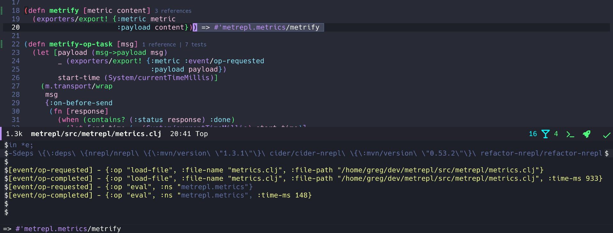

[](https://clojars.org/dev.ericdallo/metrepl)

# metrepl

_Metrics of your Clojure nREPL_

## What

Metrepl is a [nREPL middleware](https://nrepl.org/nrepl/design/middleware.html) that get metrics about your REPL usage (startup time, ops, eval, load-file, errors, client info and more) and export to multiple configurable places. 
This is useful to have metrics about the REPL usage and understand how users are using its features, if they are facing a specific problem, slowness.

## Getting started

1. `echo '{:exporters {:stdout {:enabled? true}}}' > .metrepl.edn` - create a metrepl config in your project (there are other ways to configure, check [configuration](#configuration))
2. Add metrepl middleware:
   - Leiningen: Add in your `project.clj` or `~/.lein/profiles.clj`:
```clojure
   :repl {:dependencies [[dev.ericdallo/metrepl "x.y.z"]]
          :repl-options {:nrepl-middleware [metrepl.middleware.op-metrics/wrap-op-metrics
                                            metrepl.middleware.tests-metrics/wrap-tests-metrics]}}
```
   - Clojure: Add in your `deps.edn` or `~/.clojure/deps.edn`
```clojure
 {:aliases {:cider/nrepl {:extra-deps {dev.ericdallo/metrepl {:mvn/version "x.y.z"}}
                          :main-opts ["-m" "nrepl.cmdline" "--middleware" "[cider.nrepl/cider-middleware metrepl/middleware]"]}}}
```

3. After starting and using your nREPL, you should see metrics being printed to stdout:


## Concepts

### Metrics

Metrepl follows a standard of `<type>/<metrics-id>`, example: `event/op-completed` and each metric may have additional info in its `payload`,  besides that all metrics have information about the os, hostname and unique id for the nREPL session.

For all available metrics, check [here](./docs/all-metrics.edn).

### Exporters

Available exporters:

- `stdout`: Export the metric to current nREPL process stdout, useful for debugging.
- `file`: Export the metric to a file, appending each metric in a new line.
- `otlp`: Export the metric via [OpenTelemetry](https://opentelemetry.io/) to what user configured.

By default no exporter is enabled, you need to manually configure which one(s) you want to enable, example: `{:exporters {:stdout {:enabled? true}}}`.

For all available exporters and their configs, check [here](./docs/all-configs.edn).

### Configuration

Metrepl supports a advancded configuration via the following waterfall, merging from top to bottom:

1. base: fixed config var `metrepl.config/initial-config`.
2. classpath: searching for a `metrepl.exports/config.edn` file in the current classpath.
3. env var: searching for a `METREPL_CONFIG` env var which should contains a valid edn config.
4. config-file: searching from a local `.metrepl.edn` file.
5. dynamic-var: the dynamic value in `metrepl.config/*config*`.

Check all available configuration options in [all-configs.edn](docs/all-configs.edn) or [metrepl.config](https://github.com/ericdallo/metrepl/blob/master/src/metrepl/config.clj#L14).

### Error handler

By default, any error on exporting is supressed, to configure that behavior you can set one or more `:error-handler` on config, check [all-configs.edn](docs/all-configs.edn)

# Support 

Consider support the work of this project [here](https://github.com/sponsors/ericdallo) ❤️
